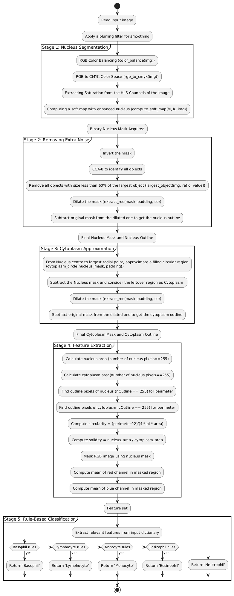

# White Blood Cell analysis and classification

## Overview

This project implements a complete pipeline for analyzing and classifying **white blood cells (WBCs)** from microscopic images. The system performs **nucleus and cell segmentation**, extracts **shape and color-based features**, and classifies cells into five types:

- Neutrophils
- Lymphocytes
- Monocytes
- Eosinophils
- Basophils

Classification is based on a **rule-based system** designed through careful analysis of extracted feature distributions. Since this was done for an image processing course, there was a requirement to make all functions from scratch where possible instead of using their built-in counterparts. Replacing the built-in functions would make the program more efficient. 

---
## Features:

- **Color space-based nucleus segmentation** using CMYK and HLS transforms to improve nucleus visibility
- **Nucleus Isolation** via connected component analysis (CCA)
- **Cell mask approximation** using dilation and geometric heuristics
- **Feature extraction** from nucleus and cell regions:
  - Area, Perimeter, Circularity, Solidity
  - Mean RGB values
- **Rule-based classification** of WBCs using observed thresholds from sample data

---

## System Flowchart

The following flowchart outlines the complete WBC analysis and classification pipeline:



## Project Structure
```plaintext
wbc-classification/
|
├── src/
│ ├── nucleusmask.py # Color space transforms, segmenting nucleus
│ ├── segmentationAndMasks.py # Nucleus and cytoplasm masking through CCA-8 and shape approximation
│ ├── features.py # Shape & color feature extraction
│ └── classification.py # Basic rule-based classification logic
│
├── main.py # Main pipeline 
├── README.md
├── LICENSE
└── .gitignore
```

## File and Function Descriptions

### `main.py`
Runs the full classification pipeline:
- Preprocessing → Segmentation → Feature extraction → Classification 

### `src/nucleusmask.py`
- `color_balance(img)`: Averages RGB channels
- `rgb_to_cmyk(image)`: Extracts CMYK channels
- `compute_soft_map(image)`: Extracts HLS saturation channel and generates soft map
- `threshold_nucleus(soft_map)`: Adaptive thresholding based on soft-map
- `segment_nucleus(image)`:Applies all the above functions in order to extract nucleus from cell image slide

### `src/segmentationAndMasks.py`
- `ccn8(img)`: Labels connected components using 8-connectivity
- `conv(img, mask_size, mask_val)`: Applies an averaging blur, can be replaced by cv2.blur
- `largest_object(img, value)`: Keeps only the largest object and assigns a specific label
- `dilation(image, mask_size, se_option)`: Fills in missing bits to smoothen the image
- `mask_outline(mask, mask_size, se_option)`: Gets the mask boundary for perimeter estimation
- `cytoplasm_circle(nucleus_mask, padding)`: Obtains the cytoplasm mask by dilating the nucleus mask and approximating a circle

### `src/features.py`
- `extract_features(img, nMask, nOutline, cyto, cOutline)`: Calculates area, perimeter, circularity, solidity and averages RGB channels

### `src/classification.py`
- `classify_wbc(features)`: Applies rule-based thresholds to assign one of 5 WBC classes

---

## Usage 

1. Clone the repository:

```bash
git clone https://github.com/yourusername/wbc-classification.git
cd wbc-classification
```
2. Access datasets: https://drive.google.com/file/d/1ngIbP2j5nDbao81IH2VRa-iQGKIDgneM/view?usp=sharing
### The dataset consists of two main folders: 
1. Train Folder 
  Contains five subfolders:  
#### ▪ Neutrophil 
#### ▪ Monocyte 
#### ▪ Lymphocyte 
#### ▪ Eosinophil 
#### ▪ Basophil 
• Each subfolder has 100 images captured at 100x magnification. 
2. Test Folder 
#### • Contains the same five subfolders (50 images each). 
##### • Used for evaluating model performance.

3. Run main.py.

## Dependencies
This project requires the following Python packages:
- numpy
- opencv-python
- matplotlib
- scikit-image

```bash
pip install numpy opencv-python matplotlib scikit-image
```
## Confusion Matrix (Test Set)

| Actual \ Predicted | Monocyte | Lymphocyte | Neutrophil | Basophil | Eosinophil |
|--------------------|----------|------------|------------|----------|-------------|
| **Monocyte**       | 9        | 0          | 1          | 0        | 5           |
| **Lymphocyte**     | 0        | 13         | 0          | 0        | 2           |
| **Neutrophil**     | 0        | 1          | 13         | 0        | 1           |
| **Basophil**       | 2        | 0          | 0          | 11       | 2           |
| **Eosinophil**     | 3        | 1          | 3          | 0        | 8           |


## References

1.  Tavakoli, Sajad, et al. “New Segmentation and Feature Extraction Algorithm for Classification of White Blood Cells in Peripheral Smear Images.” Scientific Reports, vol. 11, no. 1, 30 Sept. 2021, 
https://doi.org/10.1038/s41598-021-98599-0. 
2. Bharathi. “Confusion Matrix for Multi-Class Classification.” Analytics Vidhya, 24 June 2021, 
www.analyticsvidhya.com/blog/2021/06/confusion-matrix-for-multi-class-classification/. 
3. Rustam, Furqan, et al. “White Blood Cell Classification Using Texture and RGB Features of 
Oversampled Microscopic Images.” Healthcare, vol. 10, no. 11, 1 Nov. 2022, p. 2230, 
www.mdpi.com/2227-9032/10/11/2230, https://doi.org/10.3390/healthcare10112230.

##### License
This project is licensed under the MIT License.
